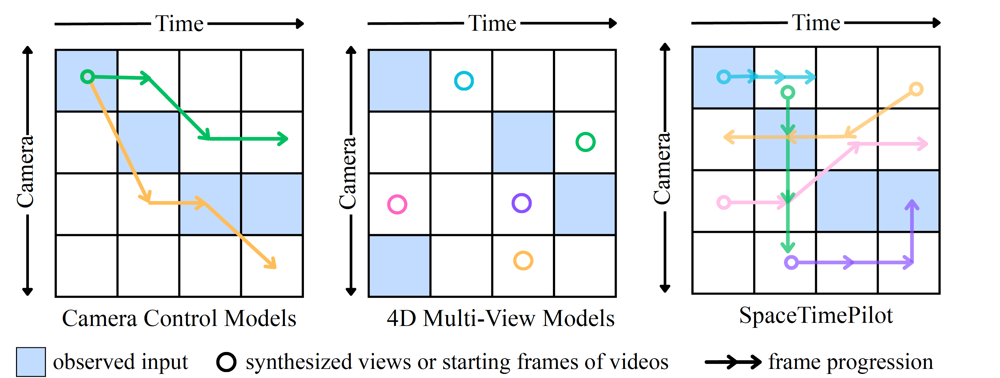

<h1 align="center">
  
  SpaceTimePilot: Generative Rendering of Dynamic Scenes Across Space and Time
</h1>


<p align="center">
  <a href="https://arxiv.org/abs/2512.25075"></a>
  <a href="https://zheninghuang.github.io/Space-Time-Pilot/"></a>
</p>


<p align="center">
  <b><a href="https://zheninghuang.github.io/">Zhening Huang</a></b><sup>1,2</sup>,
  <b><a href="https://hyeonhojeong.github.io/">Hyeonho Jeong</a></b><sup>2</sup>,
  <b><a href="https://xuelinchen.github.io/">Xuelin Chen</a></b><sup>2</sup>,
  <b><a href="https://yuliagryaditskaya.github.io/">Yulia Gryaditskaya</a></b><sup>2</sup>,
  <b><a href="https://tuanfengwang.github.io/">Tuanfeng Y. Wang</a></b><sup>2</sup>,
  <b><a href="https://www.eng.cam.ac.uk/profiles/jl221">Joan Lasenby</a></b><sup>1</sup>,
  <b><a href="https://chunhaohuang.github.io/">Chun-Hao Huang</a></b><sup>2</sup>
</p>
<p align="center">
  <sup>1</sup>University of Cambridge &nbsp; <sup>2</sup>Adobe Research
</p>

<p align="center">
  
</p>

<p align="center">
  <b>TLDR:</b> SpaceTimePilot disentangles space and time in video diffusion model for controllable generative rendering. Given a single input video of a dynamic scene, SpaceTimePilot freely steers both camera viewpoint and temporal motion within the scene, enabling free exploration across the 4D space–time domain.
</p>

## News

- <b>Code and datasets are under internal review, will be released soon once the procedure is finished.</b> 🚀📦
- <b>[2025-12-31]</b> Our paper is now available on <a href="https://arxiv.org/abs/2512.25075">arXiv</a>! 🚀

---

## What We Do

<p align="center">
  <a href="assets/concept-diagram.png"></a>
</p>

**Camera-control V2V models** such as <a href="https://arxiv.org/abs/XXXX.XXXXX">ReCamMaster</a> (Bai et al., ICCV 2025) and <a href="https://arxiv.org/abs/XXXX.XXXXX">Generative Camera Dolly</a> (Van Hoorick et al., ECCV 2024) modify only the camera trajectory while keeping time strictly monotonic.

**4D multi-view models** such as <a href="https://arxiv.org/abs/XXXX.XXXXX">Cat4D</a> (Wu et al., CVPR 2024) and <a href="https://arxiv.org/abs/XXXX.XXXXX">Diffusion4D</a> (Liang et al., NeurIPS 2024) synthesize discrete, sparse views conditioned on both space and time, but do not generate continuous temporal sequences.

**SpaceTimePilot** enables free movement along both the camera and time axes with full control over direction and speed, supporting bullet-time, slow motion, reverse playback, and mixed space–time trajectories.


## Citation

If you find this project useful for your research, please cite:

```bibtex
@article{huang2025spacetimpilot,
  title={SpaceTimePilot: Generative Rendering of Dynamic Scenes Across Space and Time},
  author={Huang, Zhening and Jeong, Hyeonho and Chen, Xuelin and Gryaditskaya, Yulia and Wang, Tuanfeng Y. and Lasenby, Joan and Huang, Chun-Hao},
  journal={arXiv preprint arXiv:2512.25075},
  year={2025}
}
```