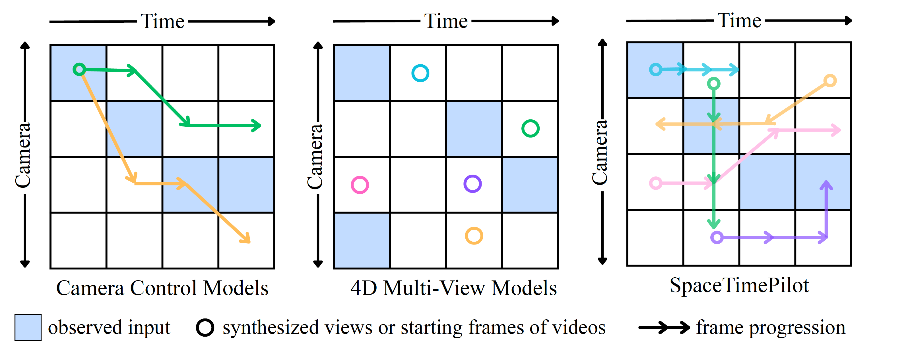

<h1 align="center">
  
  SpaceTimePilot: Generative Rendering of Dynamic Scenes Across Space and Time
</h1>

<p align="center">
  <a href="https://arxiv.org/abs/2512.25075"></a>
  <a href="https://zheninghuang.github.io/Space-Time-Pilot/"></a>
</p>


<p align="center">
  <b><a href="https://zheninghuang.github.io/">Zhening Huang</a></b><sup>1,2</sup>,
  <b><a href="https://hyeonhojeong.github.io/">Hyeonho Jeong</a></b><sup>2</sup>,
  <b><a href="https://xuelinchen.github.io/">Xuelin Chen</a></b><sup>2</sup>,
  <b><a href="https://yuliagryaditskaya.github.io/">Yulia Gryaditskaya</a></b><sup>2</sup>,
  <b><a href="https://tuanfengwang.github.io/">Tuanfeng Y. Wang</a></b><sup>2</sup>,
  <b><a href="https://www.eng.cam.ac.uk/profiles/jl221">Joan Lasenby</a></b><sup>1</sup>,
  <b><a href="https://chunhaohuang.github.io/">Chun-Hao Huang</a></b><sup>2</sup>
</p>
<p align="center">
  <sup>1</sup>University of Cambridge &nbsp; <sup>2</sup>Adobe Research
</p>

<p align="center">
  
</p>

<p align="center">
  <b>TLDR:</b> SpaceTimePilot disentangles space and time in video diffusion model for controllable generative rendering. Given a single input video of a dynamic scene, SpaceTimePilot freely steers both camera viewpoint and temporal motion within the scene, enabling free exploration across the 4D space–time domain.
</p>

## News

- **[2026-03-22]** We release the inference code of SpaceTimePilot. Training code and datasets are coming soon. 🚀
- **[2026-02-20]** SpaceTimePilot is accepted at CVPR 2026! 🎉
- **[2025-12-31]** Our paper is now available on <a href="https://arxiv.org/abs/2512.25075">arXiv</a>! 📄

---

## What We Do

<p align="center">
  <a href="assets/concept-diagram.png"></a>
</p>

**Camera-control V2V models** such as <a href="https://arxiv.org/abs/XXXX.XXXXX">ReCamMaster</a> (Bai et al., ICCV 2025) and <a href="https://arxiv.org/abs/XXXX.XXXXX">Generative Camera Dolly</a> (Van Hoorick et al., ECCV 2024) modify only the camera trajectory while keeping time strictly monotonic.

**4D multi-view models** such as <a href="https://arxiv.org/abs/XXXX.XXXXX">Cat4D</a> (Wu et al., CVPR 2024) and <a href="https://arxiv.org/abs/XXXX.XXXXX">Diffusion4D</a> (Liang et al., NeurIPS 2024) synthesize discrete, sparse views conditioned on both space and time, but do not generate continuous temporal sequences.

**SpaceTimePilot** enables free movement along both the camera and time axes with full control over direction and speed, supporting bullet-time, slow motion, reverse playback, and mixed space–time trajectories.


## 🛠️ Environment Setup 


**Requirements:** Linux, GPU with 80 GB VRAM

**Prerequisites:** [uv](https://docs.astral.sh/uv/getting-started/installation/) must be installed.

```bash
git clone https://github.com/ZheningHuang/SpaceTimePilot.git
cd SpaceTimePilot

# Create and activate a Python 3.10 virtual environment
curl -LsSf https://astral.sh/uv/install.sh | sh
uv venv --python 3.10
source .venv/bin/activate

# Install the package and all dependencies
uv pip install -e .
```


## Inference

### 1. Download Checkpoint and Demo Data

Download the Wan2.1 foundation model into `checkpoints/wan2.1/`:

```bash
mkdir -p checkpoints
python spacetimepilot/wan/download_wan2.1.py
```

Download the SpaceTimePilot checkpoint into `checkpoints/`:

```bash
hf download zhening/SpaceTimePilot SpacetimePilot_1.3B_v1.ckpt --local-dir checkpoints
```

Download the example demo videos into `demo_videos/`:

```bash
hf download zhening/SpaceTimePilot --include "demo_videos/*" --local-dir .
```

---

### 2. Single-Video Inference

Run inference on a single video with your choice of temporal and camera control:

```bash
CUDA_VISIBLE_DEVICES="0" python single_video_test.py \
    --video_path demo_videos/videos/video_53.mp4 \
    --caption "The video features a man and a woman dancing on a street in an urban setting. \
The man is wearing a beige suit with a white shirt and a dark tie, while the woman is dressed \
in a red dress with white polka dots and red heels. They are performing a dance that involves \
spins and coordinated steps. The background shows a row of buildings with classical architecture, \
including large windows and ornate balconies. The sky is clear, suggesting it might be daytime. \
There are no visible texts or subtitles within the frames provided." \
    --temporal_control freeze_late \
    --cam_type 9 \
    --src_vid_cam demo_videos/src_cam/video_53_extrinsics.npy \
    --ckpt checkpoints/SpacetimePilot_1.3B_v1.ckpt \
    --output_dir ./results/single_test
```

**Using your own video:**

```bash
CUDA_VISIBLE_DEVICES="0" python single_video_test.py \
    --video_path /path/to/your/video.mp4 \
    --caption "Describe your video here" \
    --temporal_control freeze_mid \
    --cam_type 9 \
    --ckpt checkpoints/SpacetimePilot_1.3B_v1.ckpt \
    --output_dir ./results/my_video
```

> `--src_vid_cam` is optional. If omitted, the model uses a default identity camera embedding.

**Available temporal modes:**

| Mode | Description |
|------|-------------|
| `forward` | Forward playback |
| `reverse` | Reverse playback |
| `pingpong` | Plays forward from frame 40, then reverses back |
| `bounce_early` | Forward 20→80, then back to 60 |
| `bounce_late` | Forward 60→80, then back to 20 |
| `slowmo_first_half` | Slow motion of frames 0–40 |
| `slowmo_second_half` | Slow motion of frames 40–80 |
| `ramp_then_freeze` | Play 0→40, then freeze at frame 40 |
| `freeze_start` | Bullet-time — freeze at frame 0 |
| `freeze_early` | Bullet-time — freeze at frame 20 |
| `freeze_mid` | Bullet-time — freeze at frame 40 |
| `freeze_late` | Bullet-time — freeze at frame 60 |
| `freeze_end` | Bullet-time — freeze at frame 80 |

**Available camera trajectories:**

| Index | Trajectory |
|-------|-----------|
| `1` | Pan Right |
| `2` | Pan Left |
| `3` | Tilt Up |
| `4` | Tilt Down |
| `5` | Zoom In |
| `6` | Zoom Out |
| `7` | Translate Up (with rotation) |
| `8` | Translate Down (with rotation) |
| `9` | Arc Left (with rotation) |
| `10` | Arc Right (with rotation) |

---

### 3. Batch Inference on Demo Videos

To run inference over all 61 demo videos with **Arc Left (cam 9)** and **bullet-time at frame 40 (`freeze_mid`)**:

```bash
python inference_batch.py \
    --config config/inference/demo_fixed10_cam09.yaml \
    -ckpt checkpoints/SpacetimePilot_1.3B_v1.ckpt \
    --output_dir ./results/demo_freeze_mid_cam09
```

Results will be saved to `./results/demo_freeze_mid_cam09/`. To use a different temporal mode or camera, edit `config/inference/demo_fixed10_cam09.yaml` and change the `time_mode` and `test_cameras` fields.


## Evaluation

We provide scripts to reproduce the quantitative results on the **Cam×Time evaluation benchmark** (32 scenes, 5 temporal modes, moved-cam → moved-cam).


### Evaluation Dataset

To evaluate the model, you will need to download the source videos, camera parameters, and metadata. You can choose to download the processed dataset only or include the heavy full-grid renders.

### 1. Download Processed Evaluation Dataset (Recommended)

```bash
hf download zhening/CamxTime --exclude "camxtime_evaluation_full_grid/*" --local-dir .
```

If you require the full-grid renders

```bash
hf download zhening/CamxTime --local-dir .
```

Then conduct the evaluation on Cam×Time evaluation datasets

```bash
bash all_evaluation.sh
```

### Compute metrics

```bash
source .venv/bin/activate && python eval/compute_metrics_camxtime.py \
  --pred_root results/moved_cam2moved_cam_extended \
  --gt_root CamxTime_eval/eval_gt_wan2.1_format \
  --output_dir results/camxtime_metrics
```

Outputs: `results.xlsx`, `summary.csv`, `per_video.csv`.


---

## Citation

If you find this project useful for your research, please cite: -->

```bibtex
@inproceedings{huang2026spacetimopilot,
  title={SpaceTimePilot: Generative Rendering of Dynamic Scenes Across Space and Time},
  author={Huang, Zhening and Jeong, Hyeonho and Chen, Xuelin and Gryaditskaya, Yulia and Wang, Tuanfeng Y. and Lasenby, Joan and Huang, Chun-Hao},
  booktitle={Proceedings of the IEEE/CVF Conference on Computer Vision and Pattern Recognition (CVPR)},
  year={2026}
}
```


